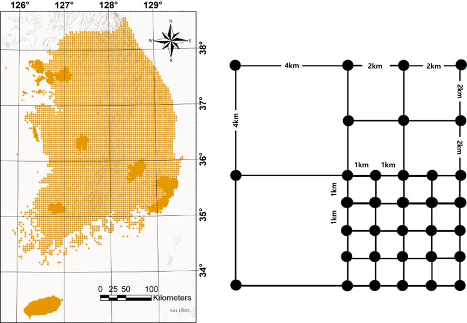
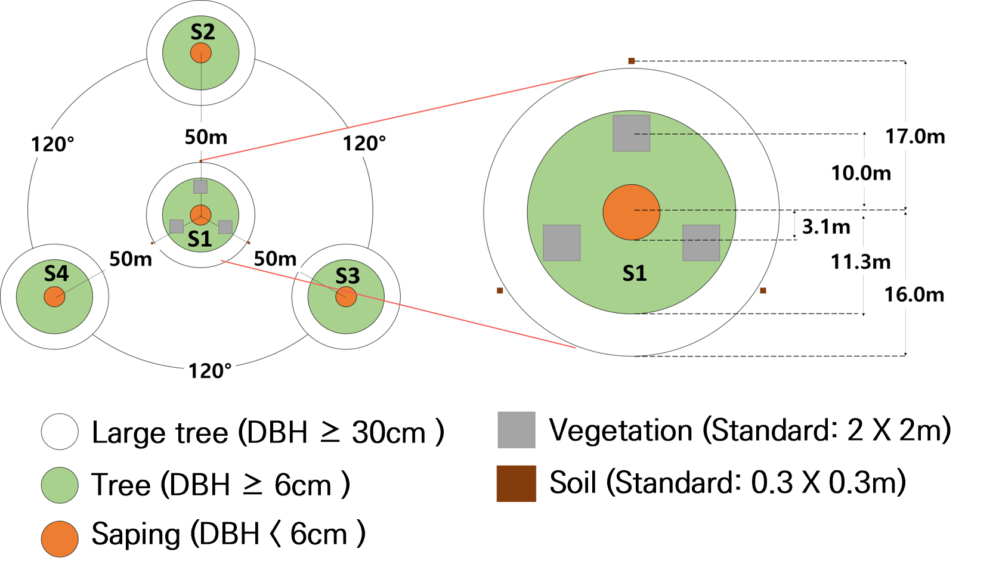

# <a href="https://syoung9836.github.io/knfi/" style="float: right; margin-right: 110px; margin-top: -15px; "></a>   knfi: Analysis of Korean National Forest Inventory Database 

<!-- badges: start -->

[](https://cran.r-project.org/package=knfi)
[](https://github.com/r-hub/cranlogs.app)

<!-- badges: end -->


## Overview

Understanding the current status of forest resources is essential for monitoring changes in forest ecosystems and generating related statistics. In South Korea, the National Forest Inventory (NFI) surveys over 4,500 sample plots nationwide every five years and records 70 items, including forest stand, forest resource, and forest vegetation surveys. Many researchers use NFI as the primary data for research, such as biomass estimation or analyzing the importance value of each species over time and space, depending on the research purpose. However, the large volume of accumulated forest survey data from across the country can make it challenging to manage and utilize such a vast dataset. To address this issue, we developed an R package that efficiently handles large-scale NFI data across time and space. The package offers a comprehensive workflow for NFI data analysis. It starts with data processing, where read_nfi() function reconstructs NFI data according to the researcher's needs while performing basic integrity checks for data quality. Following this, the package provides analytical tools that operate on the verified data. These include functions like summary_nfi() for summary statistics, diversity_nfi() for biodiversity analysis, iv_nfi() for calculating species importance value, and biomass_nfi() and cwd_biomass_nfi() for biomass estimation. Finally, for visualization, the tsvis_nfi() function generates graphs and maps, allowing users to visualize forest ecosystem changes across various spatial and temporal scales. This integrated approach and its specialized functions can enhance the efficiency of processing and analyzing NFI data, providing researchers with insights into forest ecosystems. The NFI Excel files (.xlsx) are not included in the R package and must be downloaded separately. Users can access these NFI Excel files by visiting the Korea Forest Service Forestry Statistics Platform (https://kfss.forest.go.kr/stat/ptl/article/articleList.do?curMenu=11694&bbsId=microdataboard) to download the annual NFI Excel files, which are bundled in .zip archives. Please note that this website is only available in Korean, and direct download links can be found in the notes section of the read_nfi() function.



Distribution of National Forest Inventory sample plots (left) and sampling design of the National Forest Inventory (right) (Korea Forest Research Institute, 2011)



Plot design of National Forest Inventory (Korea Forest Research Institute, 2011)

## Installation

``` r
# The easiest way to get knfi is to install just knfi:
install.packages("knfi")

# Or the development version from GitHub:
remotes::install_github("SYOUNG9836/knfi")
```

